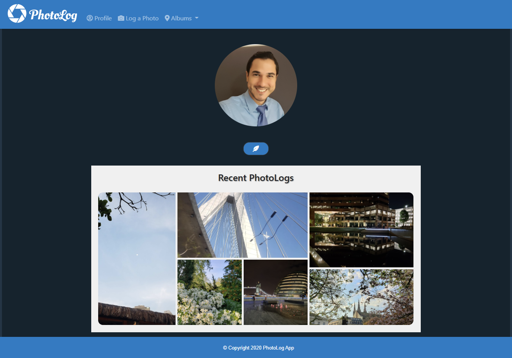

# PhotoLog    

## Description 
 
This app will allow the user to log their pictures by location.  

## Table of Contents 

* [Usage](#usage-information) 

* [Installation](#installation-instructions) 

* [License](#license) 

* [Where to Contribute](#where-to-contribute) 

* [Tests](#tests) 

* [Repository](#repository) 

* [URL](#url) 

* [Questions](#questions) 

* [Screenshots](#screenshots) 

## Usage Information 
 
    Log all pictures organized on albums by location automatically. 

## Installation Instructions 
 
    npm i  

## License 
 
This application is covered under this license: MIT

    
## Where to Contribute 
 
You can contribute on the GitHub below. 

## Tests 
 
npm test 

## Repository 
 
This repository is hosted in GitHub and you may access it at [https://github.com/johnsbrook/photo-log](https://github.com/johnsbrook/photo-log). 

## URL 
 
[PhotoLog](https://photo-logger.herokuapp.com/) 

## Questions 
 
GitHub: [johnsbrook](https://github.com/johnsbrook) 
 
Email: [ivan.zapata.rivera@gmail.com](mailto:ivan.zapata.rivera@gmail.com)

## Screenshot 
 
 
 
